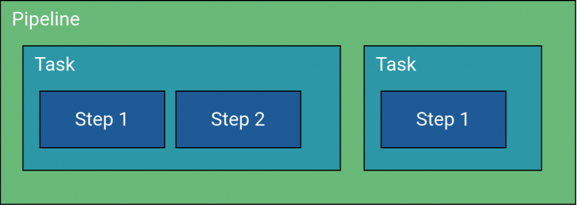

Tekton is a Kubernetes-native, continuous integration and delivery (CI/CD) framework that enables you to create containerized, composable, and configurable workloads declaratively through CRDs.
In this section we are going to define and create pipelines using Tekton to apply our defined manifests, build and deploy our images.

## {}.1: Pipelines

With OpenShift 4 pipelines come in as a tech-preview feature. They represent a cloud-native CI/CD solution based on Kubernetes resources. Under the hood it uses Tekton building blocks to automate deployment by abstracting away the underlaying implementation details. Pipelines are a serverless system which runs pipelines with all required dependencies isolated in containers.

Let's dive in and look at the resources.

OpenShift pipelines provide a set of standard Custom Resource Definitions (CRDs) that act as the building blocks for your pipeline the important concepts and resources are:

### {}.1.1: Task

A Task is the smallest configurable unit in a Pipeline. It is essentially a function of inputs and outputs that form the Pipeline build. It can run individually or as a part of a Pipeline. A Pipeline includes one or more Tasks, where each Task consists of one or more steps. Steps are a series of commands that are sequentially executed by the Task.

### {}.1.2: Pipeline

A Pipeline consists of a series of Tasks that are executed to construct complex workflows that automate the build, deployment, and delivery of applications. It is a collection of PipelineResources, parameters, and one or more Tasks. A Pipeline interacts with the outside world by using PipelineResources, which are added to Tasks as inputs and outputs.

### {}.1.3: PipelineRun

A PipelineRun is the running instance of a Pipeline. A PipelineRun initiates a Pipeline and manages the creation of a TaskRun for each Task being executed in the Pipeline.

### {}.1.4: TaskRun

A TaskRun is automatically created by a PipelineRun for each Task in a Pipeline. It is the result of running an instance of a Task in a Pipeline. It can also be manually created if a Task runs outside of a Pipeline.

### {}.1.5: PipelineResource

A PipelineResource is an object that is used as an input and output for Pipeline Tasks. For example, if an input is a Git repository and an output is a container image built from that Git repository, these are both classified as PipelineResources. PipelineResources currently support Git resources, Image resources, Cluster resources, Storage Resources and CloudEvent resources.

### {}.1.6: Trigger

A Trigger captures an external event, such as a Git pull request and processes the event payload to extract key pieces of information. This extracted information is then mapped to a set of predefined parameters, which trigger a series of tasks that may involve creation and deployment of Kubernetes resources. You can use Triggers along with Pipelines to create full-fledged CI/CD systems where the execution is defined entirely through Kubernetes resources.

### {}.1.7: Condition

A Condition refers to a validation or check, which is executed before a Task is run in your Pipeline. Conditions are like if statements which perform logical tests, with a return value of True or False. A Task is executed if all Conditions return True, but if any of the Conditions fail, the Task and all subsequent Tasks are skipped. You can use Conditions in your Pipeline to create complex workflows covering multiple scenarios.

*Static definition of a Pipeline*

*Runtime view of a Pipeline showing mapping to pods and containers*
